# DeepFake-2026Winter-Intern-Summary
Technical Report for 2026 Winter Research Internship (AISI)
> 이 문서는 2026 ETRI 동계 연구연수생(26.01.01.~26.02.28.) 기술문서입니다.  
> 작성자: 윤태현 연구연수생

## Dataset Path
All datasets are in AICA `/home/deepfake/datasets/` and folders are start with `intern_`  
`intern_zimage_turbo`: Z-Image Turbo images  
`intern_wild_img`: Wild images(from web)  
`intern_wild_vid`: Wild videos(from web)  
`intern_instagram_compression/`: Instagram Compression Test(2번 항목 참고)  

## 1. Dataset Construction
### 1-1. ⚡Generate Images with Z-Image Turbo
Open Weights 모델 중 고품질 경량 모델인 Z-Image Turbo를 바탕으로 이미지 생성을 진행함.  

- T2I Model Leaderboard: <https://artificialanalysis.ai/image/leaderboard/text-to-image>
- Z-Image Turbo: <https://github.com/Tongyi-MAI/Z-Image>
 

#### Prompt References
- parti-prompts: <https://huggingface.co/datasets/nateraw/parti-prompts>
- COCO captions: <https://huggingface.co/datasets/jxie/coco_captions>

#### Prompt Preprocessing
COCO captions의 경우 동일 image에 대한 다양한 prompt가 존재하므로, prompt length에 따라 분리하여 저장했다. 가장 포괄적인 image를 생성하기 위해 이 중 가장 짧은 prompt를 생성에 사용했다.
- `coco_prompts_original.json`: caption 원본 (Too big to upload github)
- `coco_prompts_longest.json`: 각 image에 대한 가장 긴 caption
- `coco_prompts_shortest.json`: 각 image에 대한 가장 짧은 caption
- `COCO_captions_seperate.py`: COCO cpations 분리

#### Generate with parti-prompts
- Z-Image Turbo 7 inference steps: 1,632 samples
- Z-Image Turbo 8 inference steps: 1,632 samples

#### Generate with COCO captions
- Z-Image Turbo 8 inference steps: 7,000 samples

### 1-2.  🌐Collect Images & Videos from Web(wild data)
Wild data 수집은 웹에 존재하는 무질서한 deepfake, synthesis content 수집을 일컫는다.
#### Deepfake vs Synthesis Content
여기서 분류한 기준은 절대적 기준이 아니며, 임의 분류임을 밝힌다.
- Deepfake: 유명인의 얼굴이 포함된 이미지나 비디오
- Synthesis Content: Deepfake 기준이 아닌 기타 합성 컨텐츠 전부

#### References
수집을 위해 활용한 사이트들은 다음과 같다.
- Instagram(대부분)
- Facebook
- Tiktok
- Grok
- Reddit
- Artificial Analysis
- X(구 Twitter)

#### Methods
수집을 위해 사용한 방법은 다음과 같으며, 자세한 내용은 pdf를 참고한다. [웹 데이터 수집 과정](./pdf/260120_웹_데이터_수집_방법_윤태현.pdf)

#### Results
Total 2,213 samples 수집 완료함.
 - Wild data(image): 1,813 samples
 - Wild data(video): 320 samples (Not used)

### 1-3. 📄Metadata Explanation
메타데이터는 본 연구자가 생성 및 수집한 모든 이미지 폴더와 hard samples 폴더에 적용되어 있다(intern_instagram_compression 제외).
#### Components of Metadata
- id: 고유 id 값으로, UUID 사용
- file_name: category + source + label + short UUID로 구성
- created_at: 생성 일자(wild data의 경우 download 일자)
- file_format: 파일 형식
- category: `[deepfake, synthesis]`
- source: `[generate, instagram, grok ...]`
- model: wild image의 경우 생성 모델 신뢰 불가로 인해 공란
- label: `[fake]`
- prompt: 생성 이미지의 경우 parti-prompts나 COCO captions의 prompt 첨부
- subject: parti-prompts로 생성한 경우 생성 주제가 존재하여 subject 첨부
- source_content: `null` (real image 부재로 인해 불필요 component)

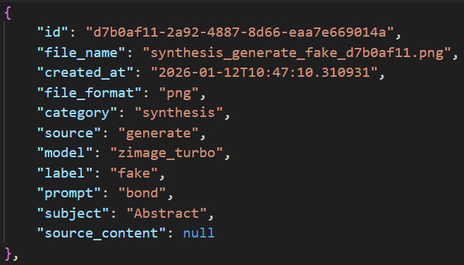

## 2. Instagram Compression Policy Reverse Engineering
### 2-1. 👨‍🔬실험 동기 및 실험 데이터셋
대부분의 wild data의 reference가 Instagram이며, Instagram의 경우 image compression policy가 정확하게 공개 되어있지 않음. Resizing, Compression 등 post-processing은 AI generated contents의 고유 artifact를 훼손하여 detection model의 dectection rate를 저하시키는 주요 요인이다.

이에 image를 실제로 업로드 및 다운로드하여 전후 비교 및 post-processing 모사 환경을 실험하여 추후 wild data를 타겟으로 한 detection test에 활용할 수 있도록 한다.

#### Dataset
- Fake Images(50 samples): Z-Image Turbo
- Real Images(50 samples): COCO(Only 1:1 scale)

#### Dataset Path(AICA, `/home/deepfake/datasets/intern_instagram_compression/`)
- `original_fake`: Original fake images
- `original_real`: Original real images
- `pc_compressed_fake`: PC environment compressed (Fake images)
- `pc_compressed_real`: PC environment compressed (Real images)
- `mob_compressed_fake`: Mobile environment compressed (Fake images)
- `mob_compressed_real`: Mobile environment compressed (Real images)

Instagram의 경우 직접 다운로드가 불가능하기 때문에 `savefrom.net` 이라는 웹사이트를 통해 우회하여 다운로드한다.
- savefrom.net: <https://ko.savefrom.net/229au/>

### 2-2. 🧪Pilot Test
앞서 언급한 100장의 데이터셋을 활용하기 전, Instagram의 Basic Upload Environment를 파악하기 위해 총 10장의 image로 pilot test를 진행한다. Instagram compression policy reverse engineering에서 사용할 용어의 정의는 다음과 같다. 
- 압축(compression) = Instagram Upload 후 Download
- n차 압축 = 압축 과정을 n번 진행

Pilot test에 활용한 image 목록은 다음과 같다.

#### Pilot Test Data
- `12m_1`~`12m_3`: Photo by smartphone(Galaxy S21, 12MP, `.jpg`)
- `64m_1`~`64m_3`: Photo by smartphone(Galaxy S21, 64MP, `.jpg`)
- `z1`~`z3`: Z-Image Tubro images(`.png`)
- `web`: Image from website(wild data, `.jpg`)

#### Test Case
- PC Environment Compression
- Mobile Environment Compression
- Compression N times

#### Results
결과는 아래와 같으며, pilot test를 통한 분석은 다음과 같다.
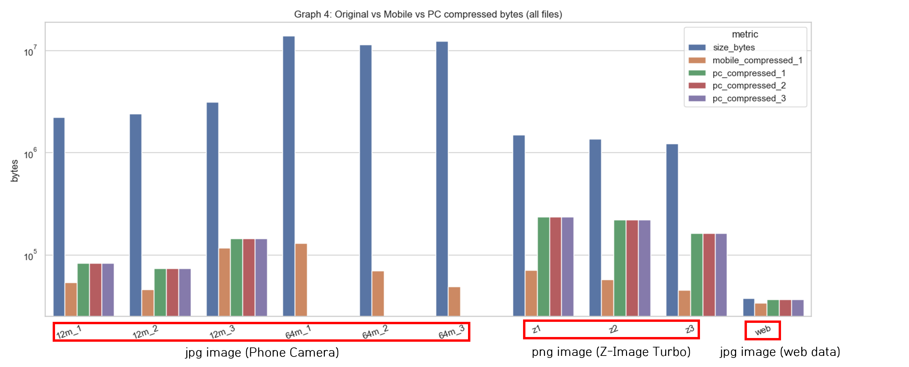 

- Mobile Environment에서 더 큰 압축이 일어난다.
- Mobile Environment Compression의 경우 확장자가 `.webp`로 바뀌어, 2차 압축이 불가하다.
- PC Environment에서는 upload 용량 제한이 있다.(`64m_1`~`64m_3` 업로드 실패)
- 1차 압축 ~ 3차 압축의 용량 변화는 거의 없다.

### 2-3. ⬆️Instagram Compression Policy by Upload Environment
Pilot test의 결과를 바탕으로, 본 실험 시 n차 압축은 PC Environment에서만 진행한다.

#### Results
결과는 아래와 같다.  
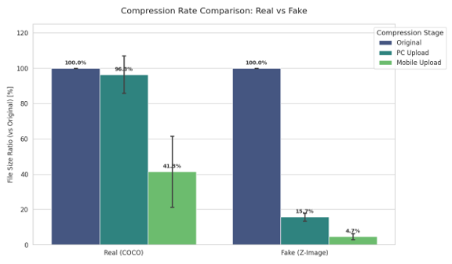

#### PC Environment
- 업로드 image에 대한 용량 제한이 존재한다.
- 업로드 시 확장자가 `.jpg`로 변환된다.
- 반복 업로드 시 용량 압축은 최초 압축 수준에서 변화가 거의 없다. (1차 압축 용량 거의 유지)
- `.webp`에 비해 용량 손실이 덜 일어난다.
#### Mobile(app) Environment
- 업로드 image에 대한 용량 제한이 명시되어 있지 않다.
- 업로드 시 확장자가 `.webp`로 변환된다.
- `.webp`로 변환된 image는 재업로드가 불가하다(`.webp` 형식 미지원).
- `.jpg`에 비해 용량 손실이 더 일어난다.

### 2-4. 📊Detection Test with Compressed Images
Instagram의 compression policy가 적용된 images를 바탕으로 2가지 탐지 모델의 탐지 성능 변화를 관찰한다.

#### Detection Model
- SAFE: <https://github.com/Ouxiang-Li/SAFE>
- SDXL: <https://huggingface.co/Organika/sdxl-detector>

#### Results
탐지 성능 변화는 다음과 같다.  
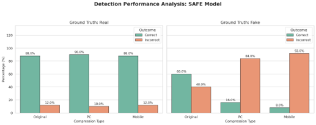
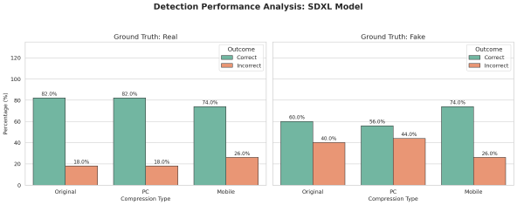

#### SAFE Model Result
SAFE 모델의 경우 압축 품질에서도 real images에 강건한 모습이나, fake images에 취약함을 드러냈다. 추가로, Mobile environment에서 압축된 image(`.webp`)의 경우 더욱 취약한 모습을 보여준다.

#### SDXL Model Result
SDXL 모델의 경우 압축 품질에서 real images와 fake images 모두 흔들리는 모습을 보여준다. 이 사실을 바탕으로 SDXL의 모델 신뢰도가 낮다고 평가되어 추후 SOTA Model Detection Test의 후보 모델에서 제외하였다.

### 2-5. 🎭Instagram Photo Upload Environment Simulation
Instagram의 압축 환경을 모사하기 위해 다양한 resizing, compression을 진행하여 가장 유사한 환경값을 찾아낸다. REsizing과 compression을 위해 활용한 코드는 `./scripts/compression_simul.py`를 참고한다.

#### Tools
- Bicubic / Lanczos 보간법: 고급 resizing 기법
- JPEG, WebP Compression: 각각 PC, Mobile Environment 모사
- Stay-Positive(Corvi+): Deepfake detection model의 score로 유사도 측정

#### Dataset
- Z-Image Turbo(50 samples): 1024x1024의 균일한 resolution
#### Test Settings: PC Environment
- Bicubic 보간법으로 resizing
- JPEG 압축(`Q=[80, 84, 88, 92, 96, 100]`, 기초 실험을 통해 구간 선정)
- (실제 compressed image - test image)를 Stay-Positive(Corvi+) score로 측정(MAE)
#### Test Settings: Mobile Environment
- Lanczos 보간법으로 resizing
- WebP 압축(`Q=[40, 44, 48, 52, 56, 60]`, 기초 실험을 통해 구간 선정)
- (실제 compressed image - test image)를 Stay-Positive(Corvi+) score로 측정(MAE)

#### Results
결과는 다음과 같다.  
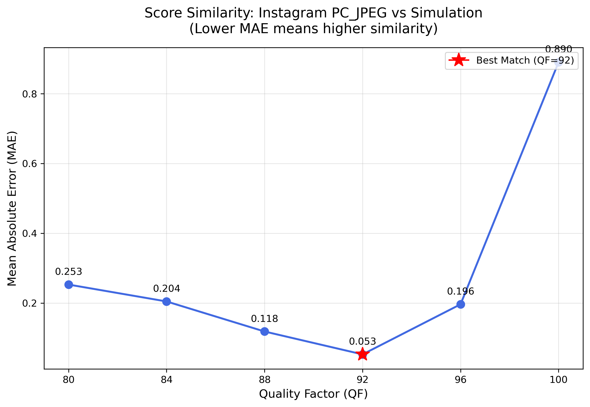
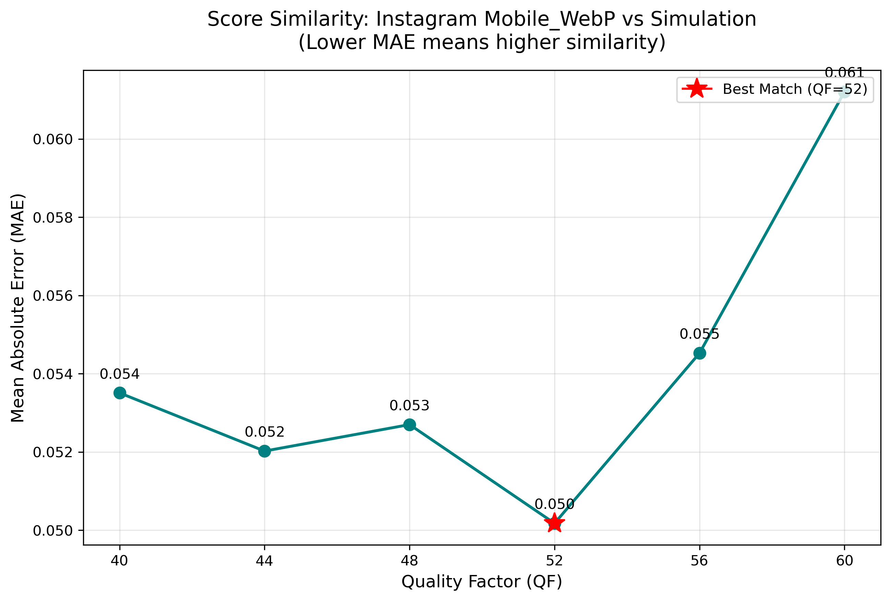

결과를 통해 얻을 수 있는 사실은 다음과 같다.
- JPEG 압축 시 `Q=92`에서 가장 비슷한 결과값이 나온다.
- WebP 압축 시 `Q=52`에서 가장 비슷한 결과값이 나온다.

#### Limitation
- Stay-Positive(Corvi+) score를 활용한 유사도 판단의 유효성
- 다양한 resizing 기법의 적용 필요
- 실제 Instagram의 적응형 압축 환경 모사의 한계점
- Spectrum library 적용의 한계(Meta, 2019, C++ 기반으로 test에 적용하지 않음)
- JPEG quality factor scale이 너무 높게 나옴

## 3. SOTA Model Detection Test
### 3-1. 🤖Detection Model & Dataset List
인턴 기간동안 생성 및 수집한 image dataset에 대해 현존하는 SOTA deepfake detection model들을 활용하여 성능 검증 및 detection model을 회피하는 hard samples를 구축하는데에 그 목적을 둔다.

SOTA detection model과 dataset은 아래와 같다.

#### Detection Model
- DDA: <https://github.com/roy-ch/Dual-Data-Alignment>
- B-Free: <https://github.com/grip-unina/B-Free/tree/main>
- SAFE: <https://github.com/Ouxiang-Li/SAFE>
- Stay-Positive(Rajan+): <https://github.com/AniSundar18/AlignedForensics>
- Stay-Positive(Corvi+): <https://github.com/AniSundar18/AlignedForensics>

#### Dataset
- COCO real dataset(1,000 samples)
- Z-Image Turbo (7,264 samples)
- Wild Data (1,893 samples)
- GPT (347 samples)
- Nano Banana (447 samples)

### 3-2. 📝Test Result
각 dataset에 대한 detection model의 accuracy는 다음과 같다.  
| Dataset | DDA | B-Free | SAFE | Rajan/Ours+ | Corvi+ |
|---|---|---|---|---|---|
| COCO_real (1,000) | 0.97 | 0.99 | 0.784 | 0.999 | 0.999 |
| Z-Image Turbo (7,264) | 0.203 | 0.266 | 0.709 | 0.032 | **0.940** |
| Wild_data (1,893) | 0.197 | **0.376** | 0.071 | 0.131 | 0.203 |
| Nano Banana (447) | 0.53 | 0.463 | 0.839 | 0.894 | **0.991** |
| GPT (347) | 0.009 | 0.04 | 0.741 | 0.034 | **0.867** |

### 3-3. ❌Hard Samples
5개의 detection model을 모두 회피한 samples를 'Hard Samples'로 정의하며, 최종적으로 974 hard samples를 수집했다.  
| Dataset | Hard Samples |
|---|---|
| Z-Image Turbo (7,264) | 40 |
| Wild_data (1,893) | 892 |
| Nano Banana (447) | 0 |
| GPT (347) | 42 |

## 4. Image Degradation Test
### 4-1. 👨‍🔬실험 동기 및 실험 데이터셋
Image Degradation Test는 Wild Data의 매우 높은 탐지기 회피율을 바탕으로, 실제 어떤 wild한 성질들이 실제 detection model의 탐지율 저하를 이끌어내는지 알아내고자 진행했다.

Detection Model은 SOTA Detection Model Test에서 가장 높은 성능을 보인 Stay-Positive(Corvi+)(이하 Corvi+)를 사용했으며, dataset은 fake image인 Z-Image Turbo와 real image인 redcaps, synthbuster를 활용했다. COCO dataset의 경우 Corvi+ train에 일부 사용되었다는 사실을 바탕으로 제외시켰다.

- Degradation code: `./scripts/degradation_simul.py`

#### Detection Model
- Stay-Positive(Corvi+): <https://github.com/AniSundar18/AlignedForensics>

#### Dataset
- Z-Image Turbo(Fake, 1,000 samples)
- Redcaps(Real, 3,000 samples)
- Synthbuster(Real, 1,000 samples)

### 4-2. 🔥Gaussian Noise & Gaussian Blur Test
다양한 degradation method 중, 가장 일반적이고 보편적으로 적용할 수 있는 gaussian noise와 gaussian blur를 적용했다.

#### Gaussian Noise
`scale = [0, 1, 2, 3, 4, 5, 6, 7, 8, 9, 10]`
#### Gaussian Blur
`scale = [0.0, 0.1, 0.2, 0.3, 0.4, 0.5, 0.6, 0.7, 0.8, 0.9, 1.0]`
Blur의 경우 `scale = [0.0, 0.1, 0.2, 0.3]`인 경우에 기준 pixel의 정보 함유량이 압도적으로 높아, 주변 pixel의 정보량이 거의 포함되지 않아 탐지율의 변화가 일어나지 않는다.
#### Degradation Example
`Base Image - Degradation Image`를 통해 실제 적용된 gaussian noise와 gaussian blur를 눈으로 확인한다.  

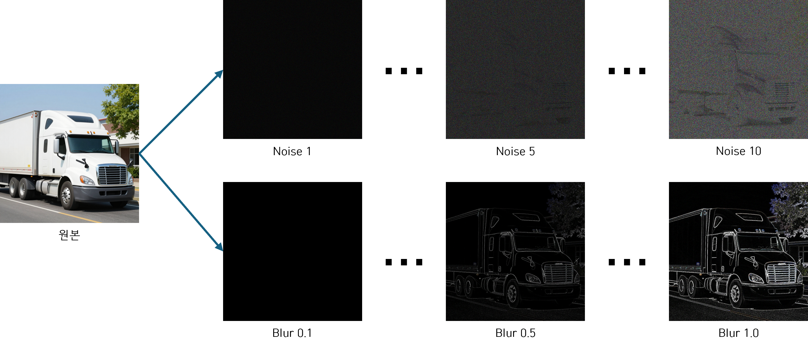

#### Detection Model
- Stay-Positive(Corvi+): <https://github.com/AniSundar18/AlignedForensics>

#### Result: Z-Image Turbo
Z-Image Turbo image에 대한 degradation test의 결과는 다음과 같다.  
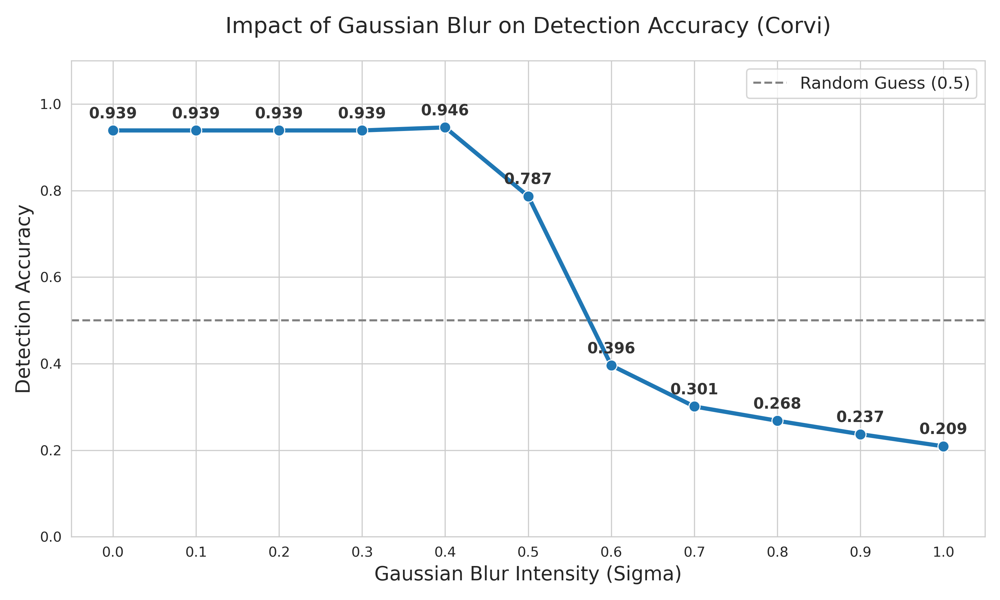
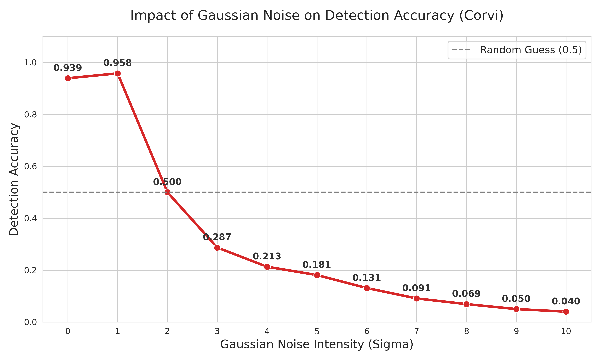

#### Result: Redcaps
Redcaps image에 대한 degradation test의 결과는 다음과 같다.  
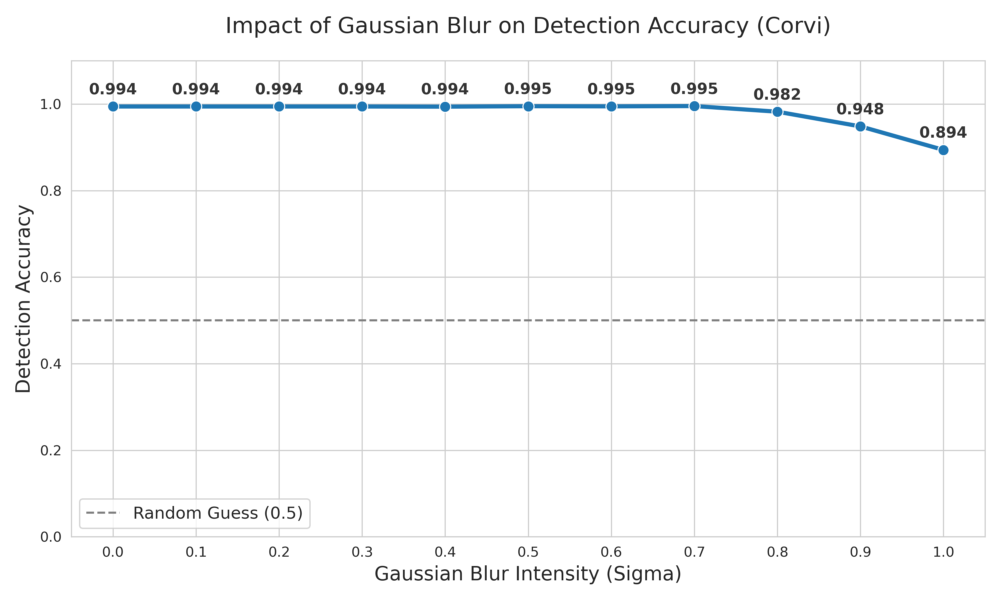
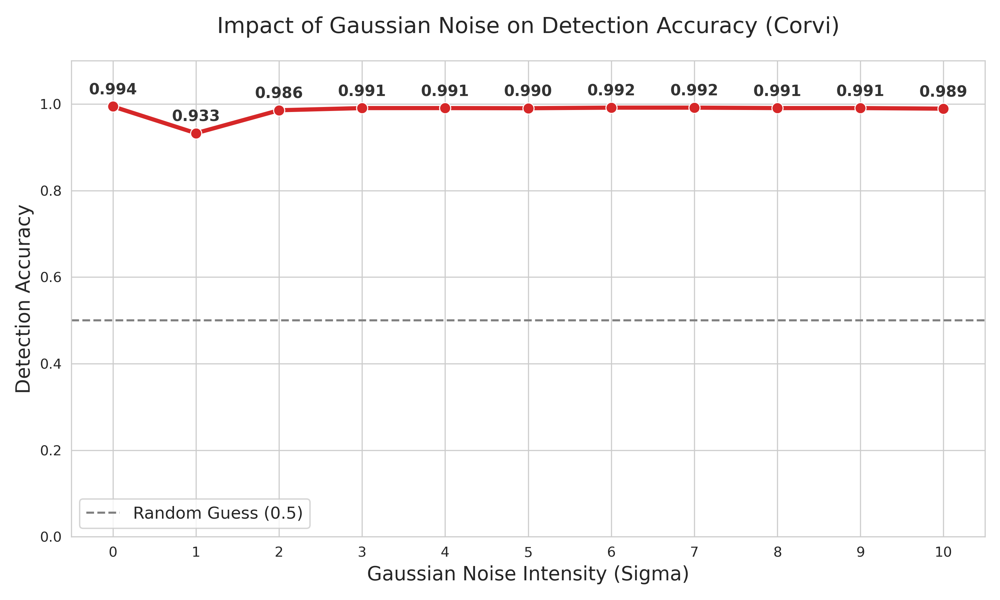

#### Result: Synthbuster
Synthbuster image에 대한 degradation test의 결과는 다음과 같다.  
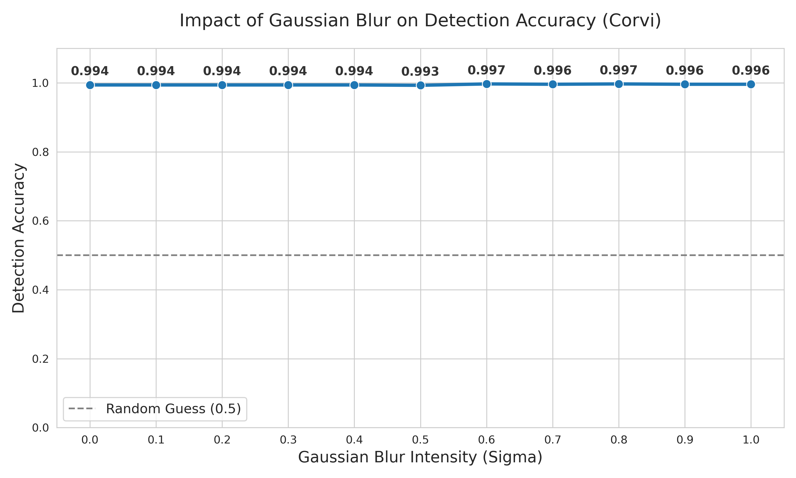
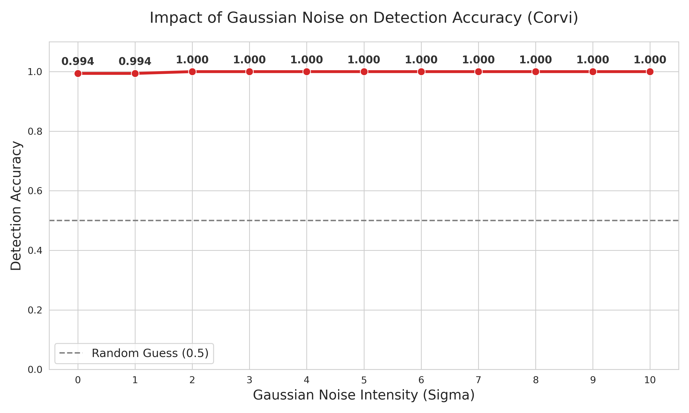

#### Total Results
- Real image의 경우 degradation으로 인한 성능 저하는 거의 없다.
- Fake image(Z-Image Turbo)의 경우 성능 저하가 심하며 noise에서 급격하다.

### 4-3. ⬛Grayscale Test
#### 가설 설정
> Gaussian noise와 gaussian blur의 경우 주변 픽셀의 값을 이용하여 degradation을 하는 방법이므로 색상에 민감할 수 있다. 그리고 이를 grayscale을 통해 일부 해소할 수 있다.
 
Gaussian noise와 gaussian blur를 사용한 이전 실험에서 그대로 grayscale을 적용하여 그대로 재실험했다.

#### Grayscale
Grayscale 'L' Mode: 8bit, `0.299*R + 0.587*G + 0.114*B`

#### Result: Z-Image Turbo
Z-Image Turbo image에 대한 degradation + grayscale test의 결과는 다음과 같다.  
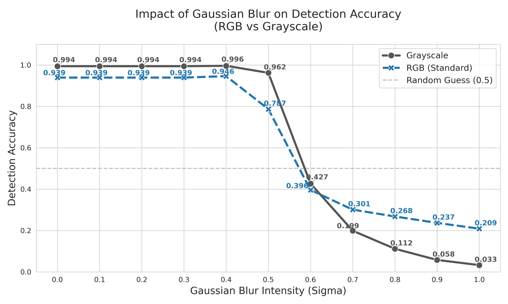
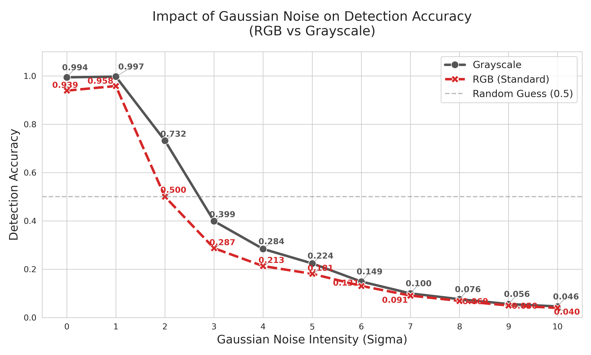

#### Result: Redcaps
Redcaps image에 대한 degradation + grayscale test의 결과는 다음과 같다.  
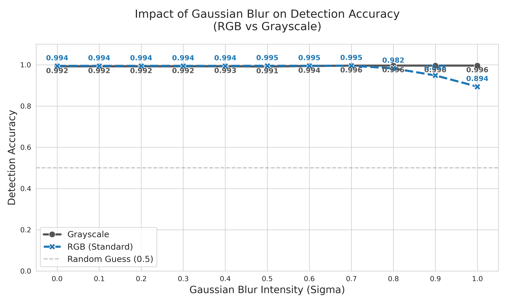
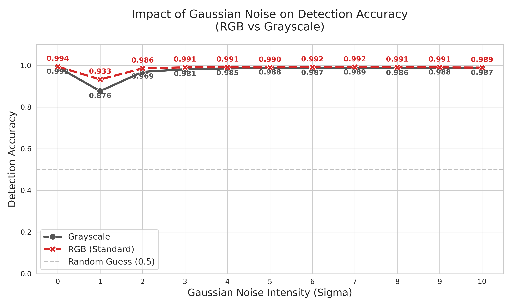

#### Result: Synthbuster
Synthbuster image에 대한 degradation + grayscale test의 결과는 다음과 같다.  
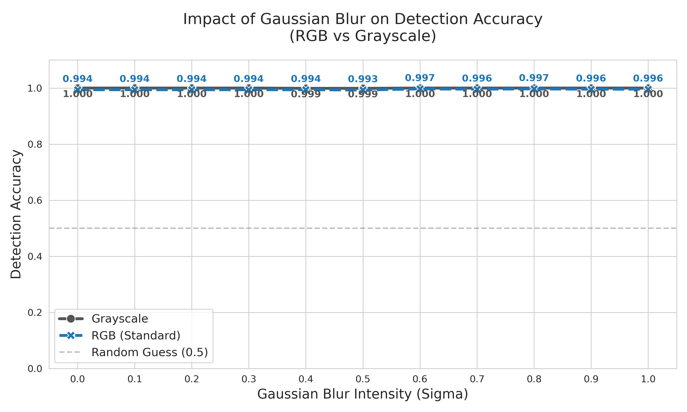
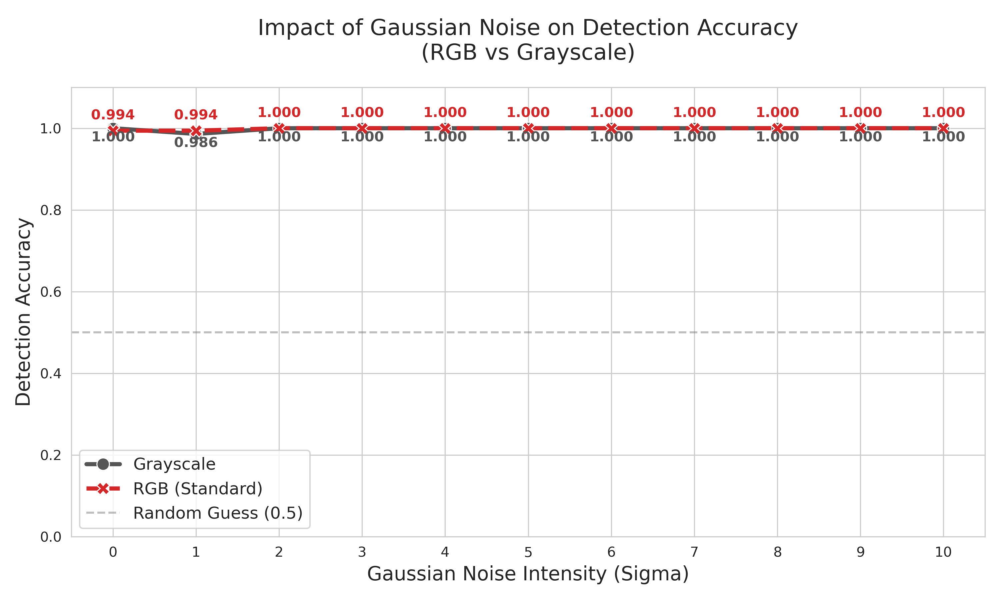

#### Total Results
- Real image는 grayscale을 적용해도 성능이 저하되지 않는다.
- Fake image는 grayscale을 적용할 경우 `threshold=0.5` 이상에서 성능이 개선된다.

Degradation과 grayscale을 적용한 실험의 최종 결과는 다음과 같다.  
|  | Blur_0.0 | Blur_0.1 | Blur_0.2 | Blur_0.3 | Blur_0.4 | Blur_0.5 | Blur_0.6 | Blur_0.7 | Blur_0.8 | Blur_0.9 | Blur_1.0 |
|---|---|---|---|---|---|---|---|---|---|---|---|
| Z-Image Turbo | 0.939 | 0.939 | 0.939 | 0.939 | 0.946 | 0.787 | 0.396 | 0.301 | 0.268 | 0.237 | 0.209 |
| Z-Image Turbo (Grayscale) | 0.994 | 0.994 | 0.994 | 0.994 | 0.996 | 0.962 | 0.427 | 0.199 | 0.112 | 0.058 | 0.033 |
| redcaps | 0.994 | 0.994 | 0.994 | 0.994 | 0.994 | 0.995 | 0.995 | 0.995 | 0.982 | 0.948 | 0.894 |
| redcaps (grayscale) | 0.992 | 0.992 | 0.992 | 0.992 | 0.993 | 0.991 | 0.994 | 0.996 | 0.996 | 0.996 | 0.996 |
| synthbuster | 0.994 | 0.994 | 0.994 | 0.994 | 0.994 | 0.993 | 0.997 | 0.996 | 0.997 | 0.996 | 0.996 |
| synthbuster (grayscale) | 1.000 | 1.000 | 1.000 | 1.000 | 0.999 | 0.999 | 1.000 | 1.000 | 1.000 | 1.000 | 1.000 |

|  | Noise_0 | Noise_1 | Noise_2 | Noise_3 | Noise_4 | Noise_5 | Noise_6 | Noise_7 | Noise_8 | Noise_9 | Noise_10 |
|---|---|---|---|---|---|---|---|---|---|---|---|
| Z-Image Turbo | 0.939 | 0.958 | 0.500 | 0.287 | 0.213 | 0.181 | 0.131 | 0.091 | 0.069 | 0.050 | 0.040 |
| Z-Image Turbo (Grayscale) | 0.994 | 0.997 | 0.732 | 0.399 | 0.284 | 0.224 | 0.149 | 0.100 | 0.076 | 0.056 | 0.046 |
| redcaps | 0.994 | 0.933 | 0.986 | 0.999 | 0.991 | 0.990 | 0.992 | 0.992 | 0.991 | 0.991 | 0.989 |
| redcaps (grayscale) | 0.992 | 0.876 | 0.969 | 0.981 | 0.985 | 0.988 | 0.987 | 0.989 | 0.986 | 0.988 | 0.987 |
| synthbuster | 0.994 | 0.994 | 1.000 | 1.000 | 1.000 | 1.000 | 1.000 | 1.000 | 1.000 | 1.000 | 1.000 |
| synthbuster (grayscale) | 1.000 | 0.986 | 1.000 | 1.000 | 1.000 | 1.000 | 1.000 | 1.000 | 1.000 | 1.000 | 1.000 |

## 5. Other Attempts
### High Frequency Bias Test
#### 가설 설정
> 압축이 진행될수록 real image와 fake image의 high-frequency 영역 분리가 일어난다.  

WildRF의 train dataset을 바탕으로 JPEG 압축을 통한 frequency 분리를 확인한다.

- Wavelet Transform Code: `./scripts/WildRF_jpg_wavelet_test.py`

#### Tools
- Wavelet Transform: 2D DWT를 사용하여 LL, LH, HL, HH로 분리(하단에 설명)
  - LL: 저주파 성분(approximation)
  - LH: 수평 방향 고주파(horizontal edge)
  - HL: 수직 방향 고주파(vertical edge)
  - HH: 대각 방향 고주파(texture, noise)
- JPEG 압축(`Q=[30, 50, 70, 90]`)

#### Dataset
- WildRF: <https://github.com/barcavia/RealTime-DeepfakeDetection-in-the-RealWorld>
- 

#### Results
Frequency 분리가 일어나지 않는다.  
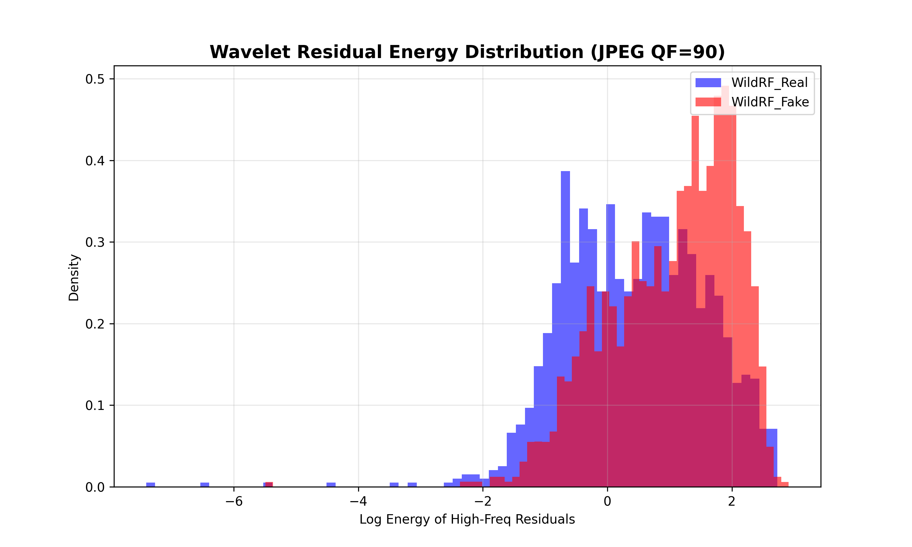
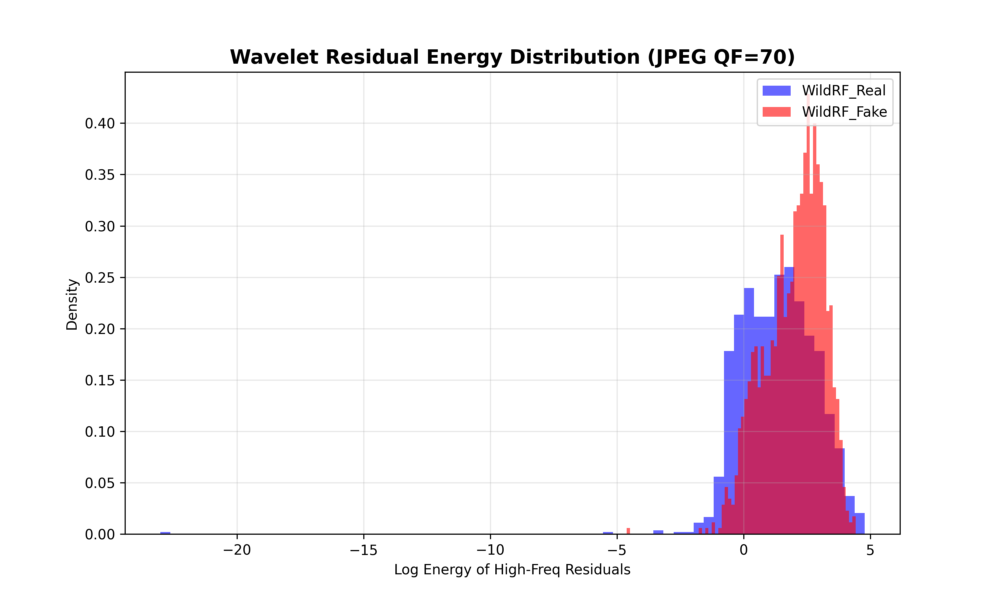
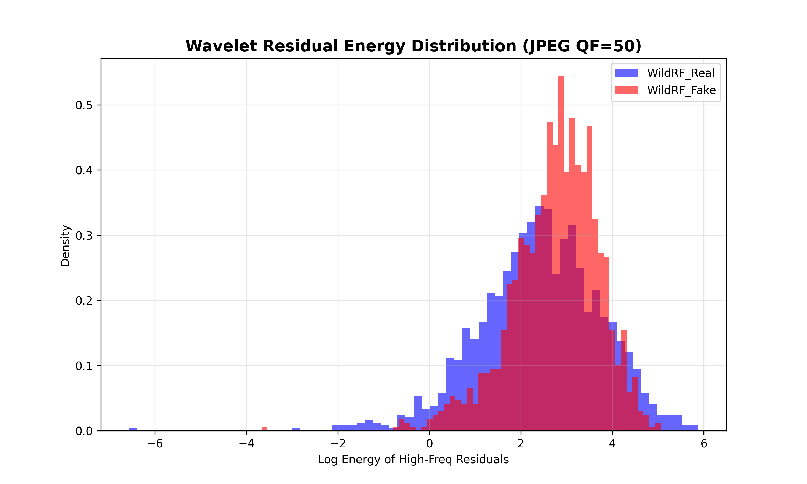
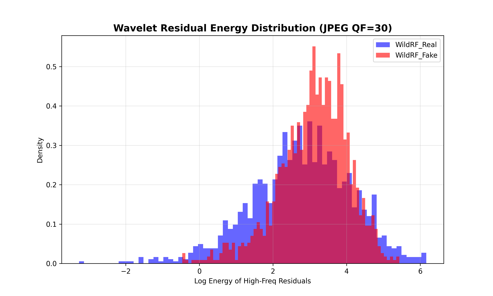

- 최신 dataset이나 benchmark의 경우 GAN뿐만 아니라 diffusion model도 많이 활용하기 때문에 단순 주파수를 통한 feature extraction에는 한계가 있다.

## 6. Further Works
- 최신 T2I model을 바탕으로 자체 dataset 주기적 update
- Instagram compression policy 모사 고도화
- Wild feature 정형화
